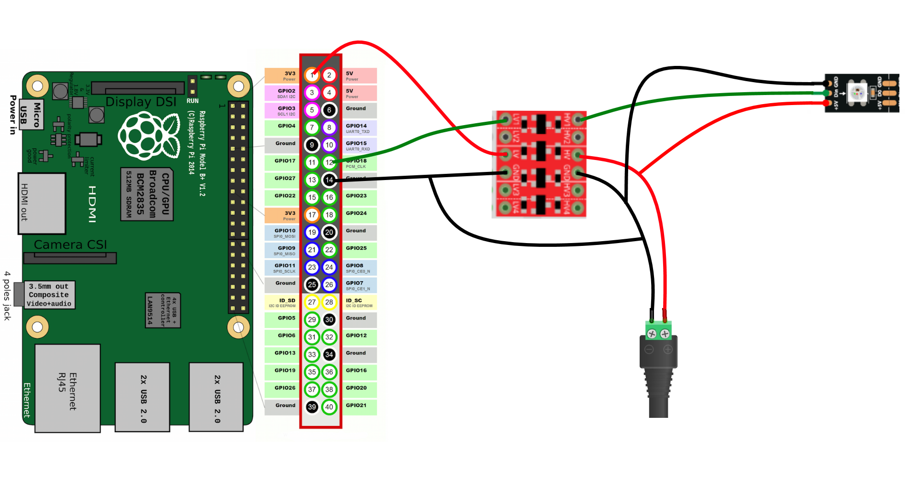
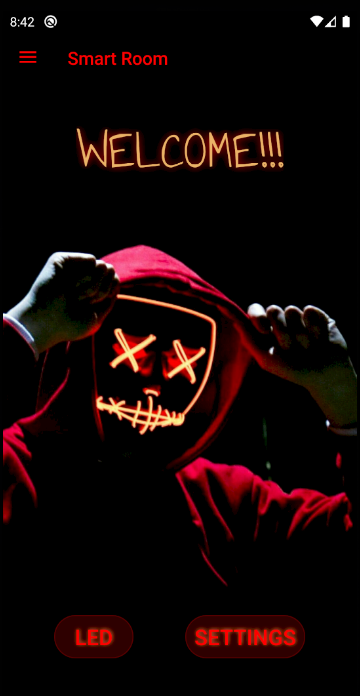
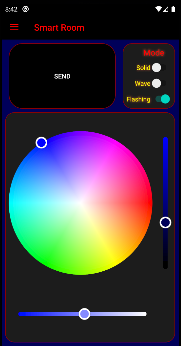
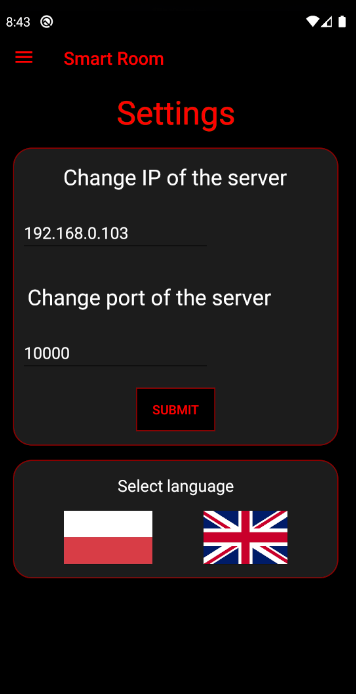

# Led system

### System

On the Raspberry Pi 4 is running python script (private repo) which is responsible for controlling led strip accordingly to received information from Android mobile app.
TCP/IP protocol is used to communicate between smarthone and RPI.

## Mobile App
  
  Application is written solely in Kotlin.
  
  
  
  
  
  
  
